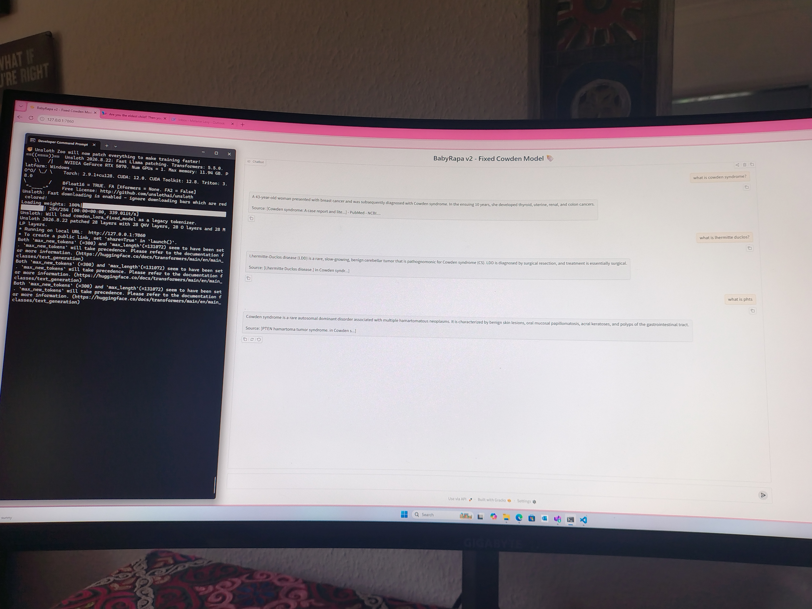

Cowden-Lora

A Cowden Syndrome specialist LoRA built on top of Llama-3.2-3B.

This is a v2 proof-of-concept trained on 250 curated Q&As. Model runs locally on RTX 5070 using Unsloth + Gradio. 

What it does
Answers questions about Cowden Syndrome, PTEN Hamartoma Tumor Syndrome, and Lhermitte-Duclos disease with curated sources.

How to run locally
```bash
pip install unsloth transformers peft trl gradio
python lora_app.py

Note

Full 50k dataset will be released on HuggingFace after curation.
Lora weights are not in this repo due to size. They are local for now.
